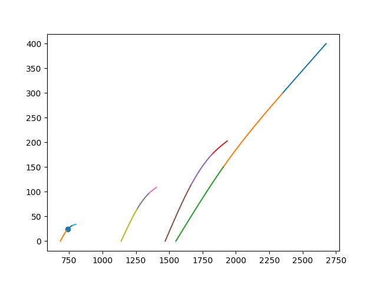

Interpolation
====================
### Интерполяция P(Q):

### Интерполяция N(P):

### Интерполяция P(N):

### Интерполяция Q(N):

Устанавливаемся на одной кривой.\n
С помощью тахометра считываем обороты вентилятора.\n

Находим сплайн на который попала точка\n

Подставляем **N** в уравнение данного сплайн **P(N)**\n

Находим **N** на каждой кривой, соответствующие выше найденному **P**\n
