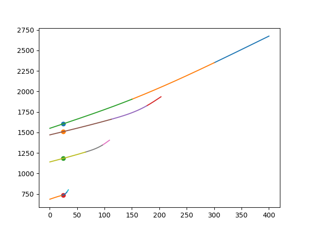
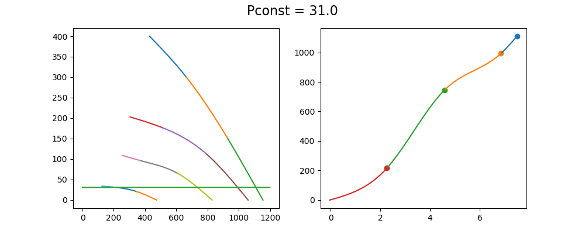

Interpolation
====================
### Интерполяция P(Q):

### Интерполяция N(P):

### Интерполяция P(N):

### Интерполяция Q(N):

Устанавливаемся на одной кривой.

С помощью тахометра считываем обороты вентилятора.

Находим сплайн на который попала точка

Подставляем **N** в уравнение данного сплайн **P(N)**

Находим **N** на каждой кривой, соответствующие выше найденному **P**

Находим расходы воздуха **Q** от **N** для каждой кривой

Составив таблицу выше полученных **Q**  с эксперементально найденными **Uупр** выполняяем интерполяцию, и получаем коеффициенты и следующий граффик

